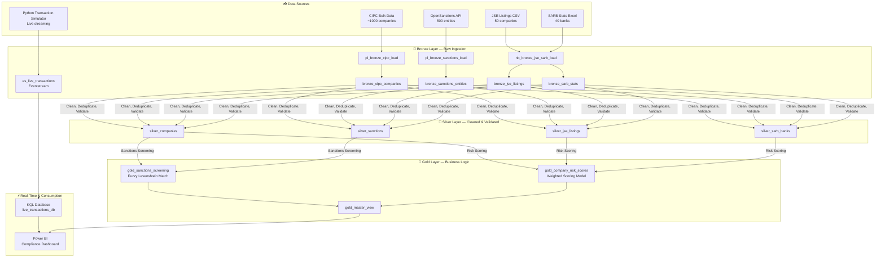
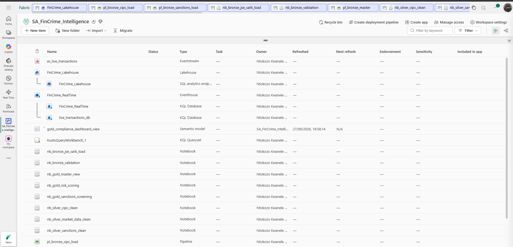
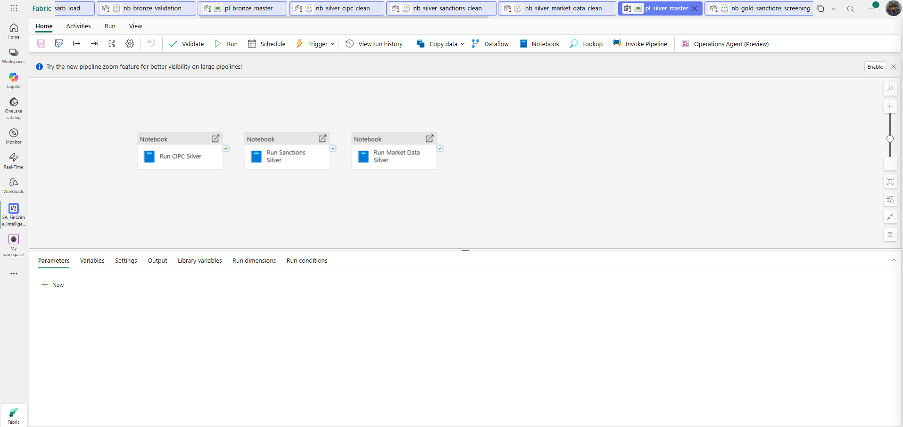
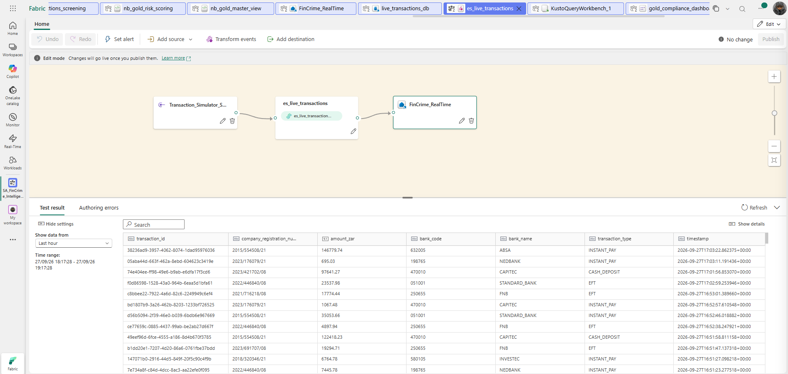
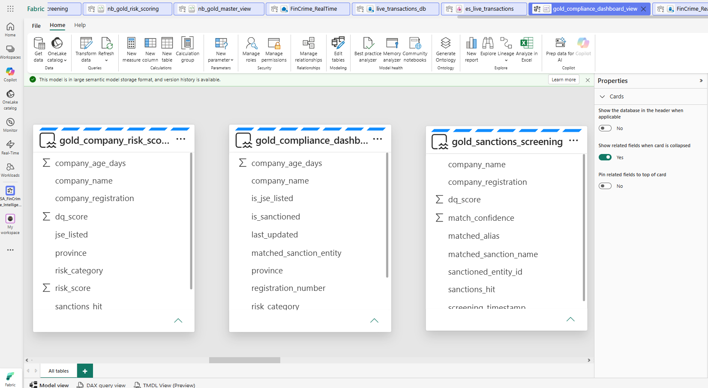

# 🏦 SA Financial Crime & Fraud Intelligence Platform

[](https://fabric.microsoft.com)
[](https://spark.apache.org)
[](https://powerbi.microsoft.com)
[](https://python.org)
[](https://learn.microsoft.com/en-us/azure/data-explorer/kusto/query/)

> **An enterprise-grade, end-to-end real-time financial crime detection platform** built on Microsoft Fabric — ingesting South African company registrations, global sanctions lists, and live banking transactions to automatically identify high-risk entities and flag suspicious activity in real time.

---

## 📌 Business Problem

South African financial institutions face strict **FICA (Financial Intelligence Centre Act)** and **AML (Anti-Money Laundering)** compliance obligations. Manually screening thousands of company registrations against sanctions lists, calculating risk scores, and monitoring live transactions is error-prone and slow.

This platform automates the entire compliance pipeline end-to-end — from raw data ingestion to a real-time fraud alert dashboard — using Microsoft Fabric's unified analytics platform.

---

## 🏗️ Architecture: Medallion + Real-Time Streaming



---

## 🖼️ Platform Screenshots

### 🗂️ Microsoft Fabric Workspace
> All platform components — Lakehouse, Eventstream, Eventhouse, KQL databases, notebooks and pipelines — unified in a single workspace.



---

### ⚙️ Bronze Master Pipeline — Orchestrated Ingestion
> `pl_bronze_master` chains 5 child pipelines sequentially: CIPC → Sanctions → JSE/SARB → Validation → Trigger Silver. All **5 activities succeeded** in a single run.


---

### 🥈 Silver Master Pipeline — Parallel Cleaning
> `pl_silver_master` runs 3 PySpark cleaning notebooks in parallel: CIPC, Sanctions, and Market Data — automatically triggered by the Bronze master on completion.



---

### ⚡ Real-Time Eventstream — Live Transaction Ingestion
> Python simulator streams SA banking transactions → `es_live_transactions` Eventstream → `live_transactions_db` KQL database at 1 transaction/2 seconds. Test result panel shows live data flowing in.



---

### 📊 Eventhouse System Overview — Active Ingestion
> `FinCrime_RealTime` Eventhouse (South Africa North region) showing 24 ingested rows, 332 minutes of query activity, and live schema changes — proof the streaming pipeline is running.


---

### 🧠 Power BI Semantic Model — Gold Layer Data Model
> Three Gold tables (`gold_company_risk_scores`, `gold_compliance_dashboard`, `gold_sanctions_screening`) modelled in Power BI with risk scores, sanctions hits, match confidence, and data quality scores.



---

## 🔑 Key Technical Features

| Feature | Implementation |
|---|---|
| **Fuzzy Sanctions Matching** | Levenshtein distance in PySpark — catches name variations at 70%+ confidence |
| **Weighted Risk Scoring** | Sanctions hit (+50), New company (+15), Low directors (+20), High-risk province (+10), JSE listed (−20) |
| **Real-Time Streaming** | Python → Azure Event Hub → Fabric Eventstream → KQL Database at sub-second latency |
| **FICA Threshold Alerts** | KQL query flags all transactions > R100,000 automatically |
| **Velocity Spike Detection** | KQL detects companies with >3 large transactions per hour |
| **Pipeline Chaining** | Bronze master auto-triggers Silver master on completion |
| **Data Quality Scoring** | Every record gets a `dq_score` throughout the pipeline |
| **Medallion Architecture** | Bronze → Silver → Gold with Delta Lake ACID guarantees |

---

## 📊 Results

| Metric | Value |
|---|---|
| Total Companies Screened | 891 |
| Sanctions Hits Detected | 14 (1.57%) |
| High-Risk Companies | 14 |
| Medium-Risk Companies | 42 |
| Low-Risk Companies | 835 |
| Live Transactions Streaming | 1 per 2 seconds |
| FICA Alerts (> R100k) | Auto-flagged in real time |
| Pipeline Success Rate | 100% (all activities ✅) |

---

## 🏛️ Architecture: Medallion Detail

### 🔵 Bronze Layer — Raw Ingestion
- `pl_bronze_cipc_load` — Loads ~1,000 CIPC company registrations into `bronze_cipc_companies`
- `pl_bronze_sanctions_load` — Ingests 500 OpenSanctions entities into `bronze_sanctions_entities`
- `nb_bronze_jse_sarb_load` — Loads JSE and SARB Excel/CSV files
- `nb_bronze_validation` — Validates row counts, nulls, and schema across all tables

### 🥈 Silver Layer — Cleaning & Standardisation
- Standardises registration numbers, dates, and province names
- Deduplicates records using business key matching
- Calculates data quality scores (`dq_score`) for every record
- Runs in **parallel** across 3 notebooks via `pl_silver_master`

### 🥇 Gold Layer — Business Intelligence
- **`nb_gold_sanctions_screening`** — Fuzzy Levenshtein matching of companies against sanctions entities
- **`nb_gold_risk_scoring`** — Weighted scoring model producing `risk_category`: HIGH / MEDIUM / LOW
- **`nb_gold_master_view`** — Unified compliance view joining all Gold tables for Power BI

### ⚡ Real-Time Layer
- **Python Simulator** — Generates realistic SA bank transactions (EFT, CASH_DEPOSIT, CARD_PAYMENT, INSTANT_PAY) with weighted high-risk company targeting
- **Fabric Eventstream** — `es_live_transactions` ingests events via Azure Event Hub Custom App endpoint
- **KQL Database** — `live_transactions_db` stores and queries streaming data
- **Fraud KQL Queries** — FICA threshold alerts, high-risk company tracking, velocity spike detection

---

## 🚀 How to Run

```bash
# 1. Clone the repository
git clone https://github.com/ntokozo078/sa-fincrime-fabric-platform.git

# 2. Set up your Fabric connection string
cp streaming/.env.example streaming/.env
# Edit streaming/.env and paste your FABRIC_CONNECTION_STR

# 3. Install Python dependencies
pip install azure-eventhub python-dotenv

# 4. Start the transaction simulator
python streaming/transaction_simulator.py
```

**In Microsoft Fabric:**
1. Run `pl_bronze_master` → automatically chains to `pl_silver_master`
2. Run Gold notebooks: `nb_gold_sanctions_screening` → `nb_gold_risk_scoring` → `nb_gold_master_view`
3. Open Power BI: `FinCrime_Compliance_Dashboard`

---

## 🛠️ Technology Stack

| Layer | Technology |
|---|---|
| **Cloud Platform** | Microsoft Fabric (OneLake, Lakehouse, Eventstream, Eventhouse) |
| **Data Processing** | Apache Spark / PySpark |
| **Storage** | Delta Lake (ACID transactions, schema enforcement) |
| **Real-Time DB** | KQL Database (Kusto Query Language) |
| **Orchestration** | Data Factory Pipelines (pipeline chaining) |
| **Streaming** | Azure Event Hub + Fabric Eventstream |
| **Visualisation** | Power BI (semantic model + compliance dashboard) |
| **Language** | Python 3, KQL, PySpark (Python API for Spark) |

---

## 📁 Repository Structure

```
sa-fincrime-fabric-platform/
├── docs/                          # 📸 Platform screenshots
│   ├── workspace.png
│   ├── master bronze pipeline.png
│   ├── pl_silver_master.png
│   ├── live_transactions.png
│   ├── real_time_system overview.png
│   └── dashboard_view.png
├── streaming/
│   └── transaction_simulator.py   # 🐍 Live transaction generator
├── kql/
│   └── fraud_alerts.kql           # 📡 KQL fraud detection queries
├── data-samples/                  # 📊 Sample datasets (CIPC, sanctions, JSE)
├── PROJECT_DOCUMENTATION.md       # 📄 Full technical documentation
└── README.md
```

---

## 👤 Author

**Ntokozo Ntombela** — Data Engineer  
Built September 2026 | Microsoft Fabric | PySpark | Real-Time Streaming
